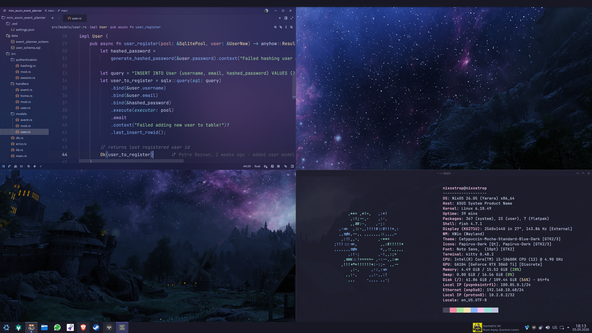

# My NixOS configuration

_My ultimate reproducible and fully contained NixOS configuration._



## Description

One master flake for two machines, written in a dendritic style

Every `.nix` file under `modules/` is automatically discovered by `import-tree` and
merged by `flake-parts`

For a new addition just make a new atom inside the `modules/` then choose
if you want to add it directly to the host or inside a bundle

I made the `system/` to be a set and forget kind of thing

Depending on the machine the `drivers/` need modifications and also the `shell(fish)` module sits there

Any path containing `/_` is skipped by `import-tree`

That is how the generated hardware scans (`_{user}_hardware.nix`) stay out of the flake

## Hosts

| Host        | Machine                  | User        |
| ----------- | ------------------------ | ----------- |
| `nixostrop` | Desktop (INTEL + NVIDIA) | `nixostrop` |
| `lapstrop`  | ASUS laptop (AMD APU)    | `lapstrop`  |

```bash
sudo nixos-rebuild switch --flake /etc/nixos#nixostrop
sudo nixos-rebuild switch --flake /etc/nixos#lapstrop

nix flake check # evaluates and builds both hosts
```

## Structure

```
data/                               static data
  avatar/                           user profile picture
  proton-vpn/                       vpn config
  wallpapers/                       default wallpaper
  zed/                              zed setup

modules/
  atoms/                              atomic modules
    {module_name}.nix

  bundles/                            import lists
    default_apps.nix
    desktop_setup.nix
    dev_setup.nix
    gaming_setup.nix

  hosts/
    empty_user/                       example user
      default.nix                     module list
      _empty_user_hardware.nix        generated by hardware scan
      empty_user_configuration.nix    user config

    lapstrop/                         laptop host
      default.nix                     module list
      _lapstrop_hardware.nix          generated by hardware scan
      lapstrop_configuration.nix      user config

    nixostrop/                        desktop host
      default.nix                     module list
      _nixostrop_hardware.nix         generated by hardware scan
      nixostrop_configuration.nix     user config

  system/                             the set and forget
    audio/
      audio.nix                       audio config

    core/
      bootloader.nix                  boot config
      core.nix                        core system modules aggregation
      fish.nix                        fish config
      graphics.nix                    graphics config
      home_manager.nix                home manager config
      locale.nix                      locale config
      my_options.nix                  per host custom options
      nixos_settings.nix              nixos settings
      printing.nix                    printing config
      storage_tweaks.nix              storage tweaks
      system_tweaks.nix               system tweaks
      users.nix                       users config

    drivers/
      amd.nix                         amd drivers for apu
      asus_control.nix                asus control for laptop
      intel.nix                       intel drivers for cpu
      nvidia.nix                      nvidia drivers for gpu
      power_max_performance.nix       power max performance config
      power_auto_profile.nix          power auto profile config

    network/
      bluetooth.nix                   bluetooth config
      network.nix                     network config
      ssh.nix                         ssh config

  checks.nix                          both hosts as flake checks
  parts.nix                           flake-parts systems

flake.nix                           master flake
```

## Adding a host

`modules/hosts/<name>/default.nix` lists modules and bundles
`{name}_configuration.nix` holds the config and mounts
`_{name}_hardware.nix` holds the hardware config

I have an `empty_user` as an example

## Theme

Catppuccin Mocha with the blue accent everywhere
